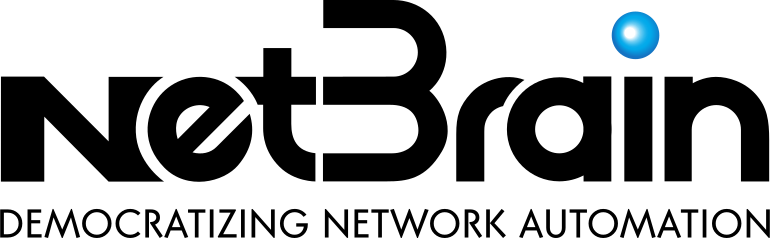
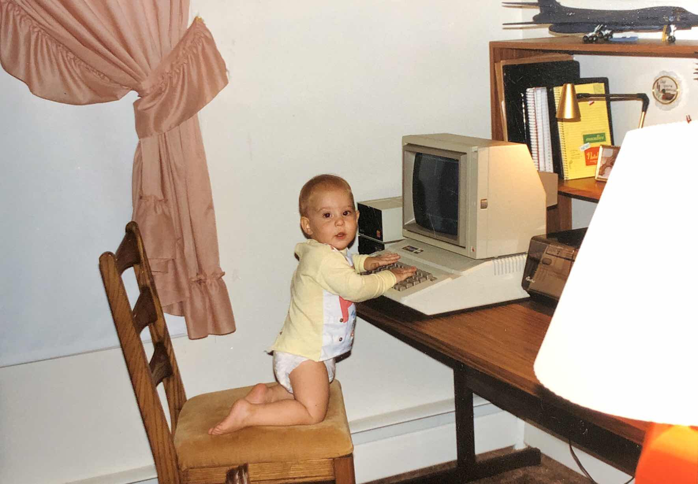

# Hello there 👋

<!-- vale Microsoft.FirstPerson = NO -->

<!-- vale Microsoft.Vocab = NO -->
My name is Brett Lykins, and my pronouns are [He/Him](https://pronoun.is/he).
<!-- vale Microsoft.Vocab = YES -->
I live in Fairfax, Virginia, USA.

    

I am the Director of Product Management at [OpsMill](https://www.opsmill.com/).

    

## Quick facts about me

One of these is a lie, and you should try to guess which one.

* 🤓 I am a new nerd who loves knowing how things work and how they're put together
* 👨🏻‍💻 🎸  I am passionate about technology and music, but after an unsuccessful year at music school I realized I should probably keep technology as a career and music as a hobby
* 💼 I spent 15 years working in Networking and Security before I began to use Python and Go to make my life easier
* ✍🏻 🎙 I write and speak about the intersection of these things to help organizations solve IT infrastructure problems

## Current projects

These are projects that I am (somewhat) actively working on.

* [cisshgo](https://github.com/tbotnz/cisshgo): A small, fast, concurrent SSH server to emulate network equipment (for example, Cisco IOS) for testing purposes.
* [Leanpub Multi Action](https://github.com/lykinsbd/leanpub-multi-action): A Github Action I built for interacting with the API of [Leanpub](https://leanpub.com/) in your authoring workflows.

## Past projects

These are projects I was actively working on in the past, but I've not touched much in recent months (or years 😅).

* [NAAS](https://github.com/lykinsbd/naas): Netmiko as A Service is an API-driven wrapper for the popular [Netmiko](https://github.com/ktbyers/netmiko) Python library for interacting with network devices.
* [Stockpiler](https://github.com/lykinsbd/stockpiler): A [Nornir](https://github.com/nornir-automation/nornir)-based tool for backing up network device configurations.

## Drumroll please

The lie was the first one, if you guessed right here is a cookie: 🍪

I am not a new nerd, but a lifelong nerd.

And here are the receipts.

My first computer:

    

Teaching my son that This is the Way:

    

<!--
**lykinsbd/lykinsbd** is a ✨ _special_ ✨ repository because its `README.md` (this file) appears on your GitHub profile.

Here are some ideas to get you started:

- 🔭 I’m currently working on ...
- 🌱 I’m currently learning ...
- 👯 I’m looking to collaborate on ...
- 🤔 I’m looking for help with ...
- 💬 Ask me about ...
- 📫 How to reach me: ...
- 😄 Pronouns: ...
- ⚡ Fun fact: ...
-->

<!-- vale Microsoft.FirstPerson = YES -->
